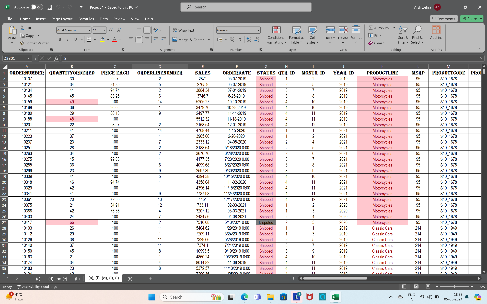
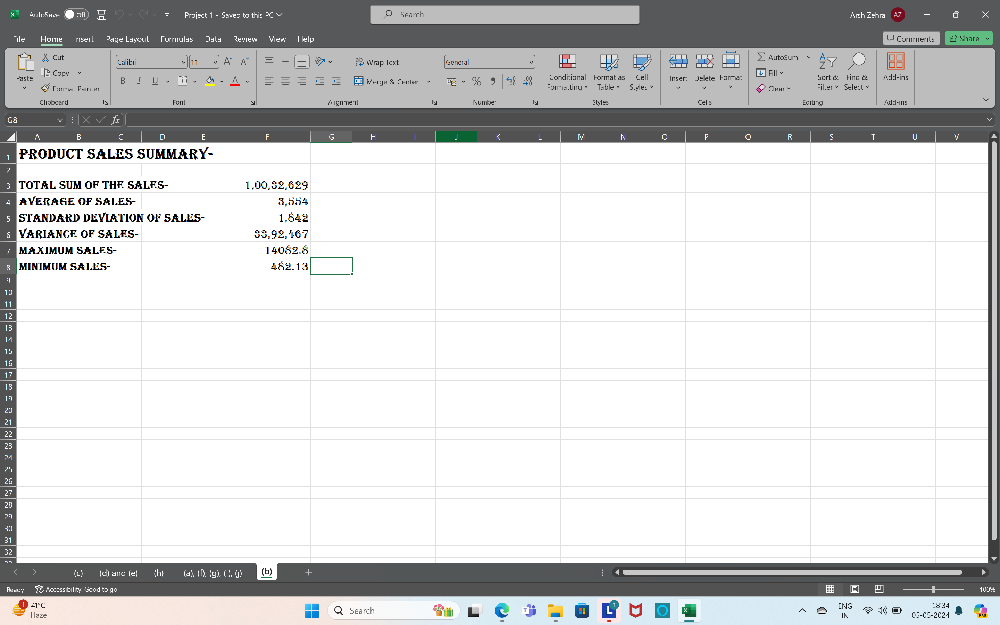
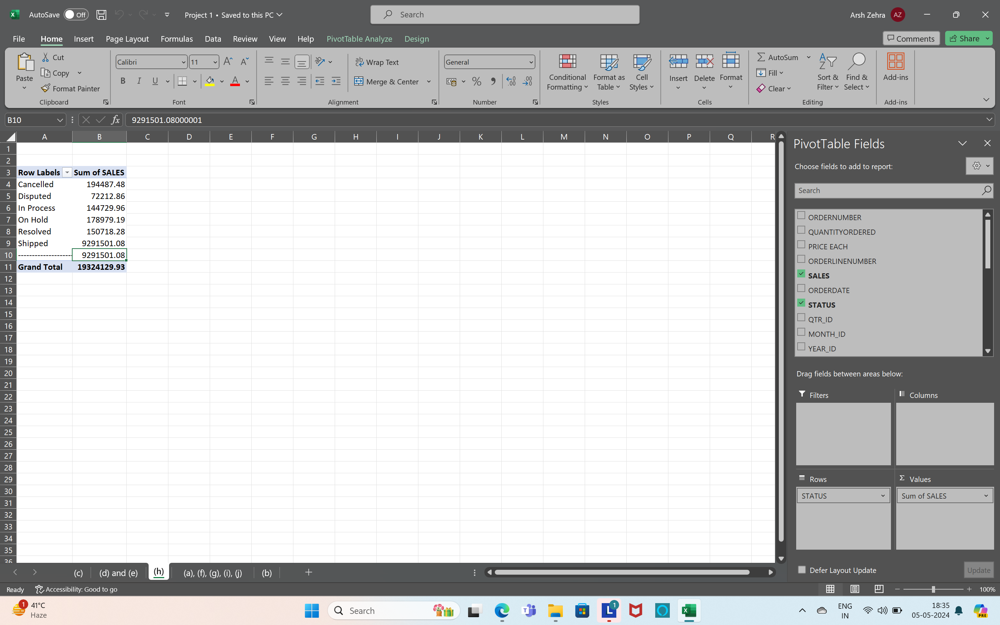

# Data-Cleaning-and-Transformation-using-Pivot-table--Excel

.png)
.png)

## Introduction
Company ABC Private Limited is manufacturing and selling below mentioned Products:
Classic Cars
Motorcycles
Planes
Ships
Trains
Trucks and Buses
Vintage Cars
As Business Analyst of the Company, you are required to perform following mentioned tasks on the provided dataset.

## Task to be performed
a. Do proper formatting of the data with using borders, font size and appropriate alignment of the content.
b. Make summary of Products Sales by providing
Total Sum of Sales
Average of Sales
Standard Deviation of Sales
Variance of Sales
Maximum Sales
Minimum Sales
c. Analyse the sales happened by product line & status using pivot table
d. Make Customized Tab by naming ABC and keep few data formatting commands in the newly created Tab.
e. Analyse the Quantities ordered by each Country in Year 2019,2020 and 2021 for different Quarters using Pivot Table.
f. Present the data in different colours for values in field Status and ProductLine using conditional formatting.
g. change values of 2003 to 2019, 2004 to 2020 and 2005 to 2021 by using proper date formatting options.
h. Calculate the total sales of all “Shipped”, “Cancelled”, “Disputed”, “In Process”, “On Hold”, “Resolved” products. (Hint:Use pivot table or sumif function)
i. Split the productcode field into two using text functions Example :S10_1678 -> S10 in one column and 1678 in another column.
j. Highlight the top 10% values of QuantityOrdered field using Conditional Formatting

## Contact Information
For inquiries or support regarding this project, please contact Arsh Zehra at zehrarsh@gmail.com.
